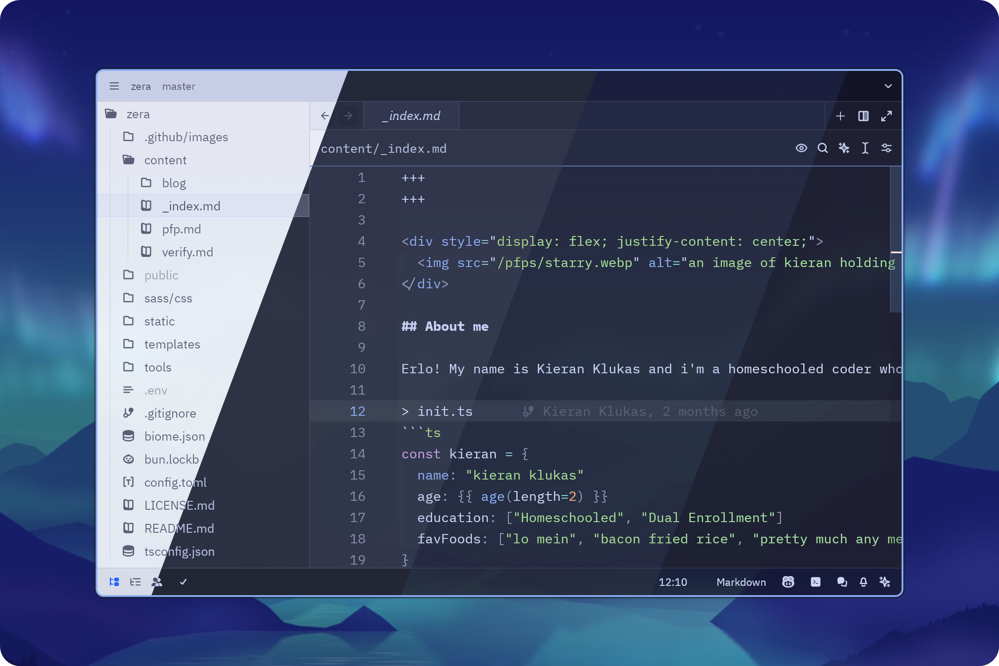
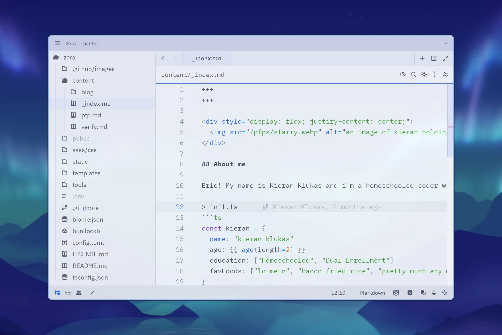
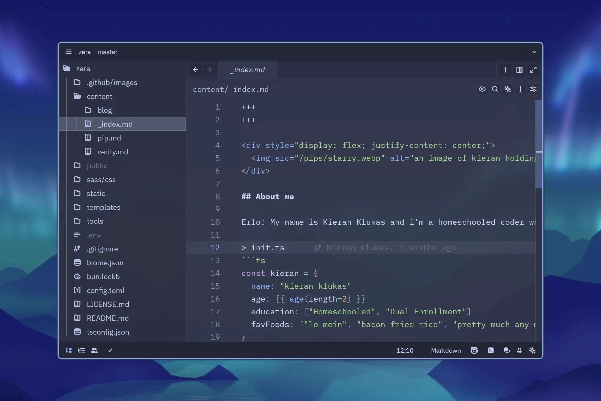
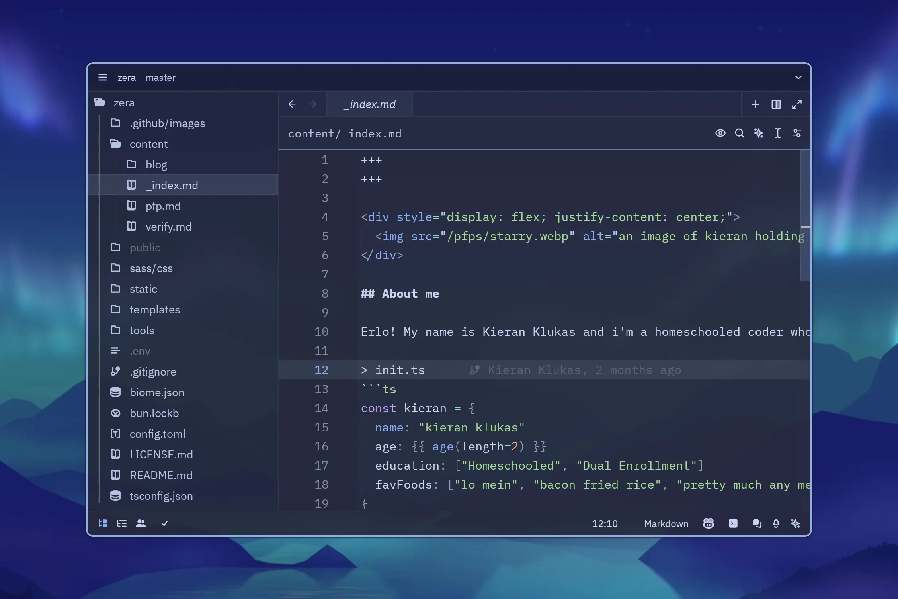
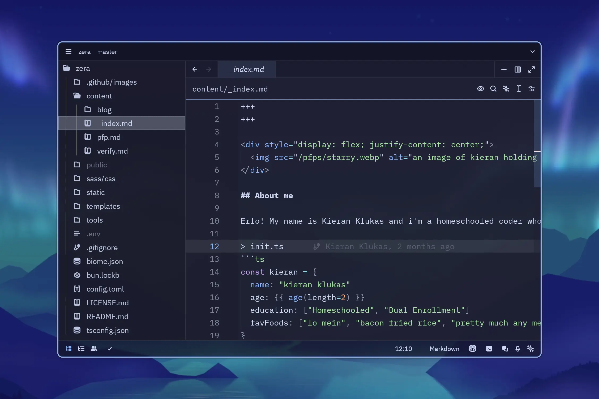

<h3 align="center">
	 
	
	Catppuccin for <a href="https://zed.dev/">Zed</a> (Blue Blur+)
	
</h3>

	

    <i>This theme is a fork of a fork ^-^</i> 
    <i>The main difference of this one is blue accents and better separation between panels</i>

## Previews

🌻 Latte

🪴 Frappé

🌺 Macchiato

🌿 Mocha

## Features

- Soothing pastel theme based on Catppuccin
- Added blur effect for a modern, frosted-glass look
- Blue accents for a refreshing touch
- Better distinction between panels for a more organized workspace

## Installation

1. Open Zed.
2. Press `cmd+shift+p` and select _zed: extensions_.
3. Search for "`Catppuccin (Blue Blur+)`" and install.
4. Select the "`Catppuccin Macchiato (Blue Blur+)`" theme in the dropdown shown after hitting `cmd+k`, `cmd+t`.

## 💖 Huge Thanks to

- the Catppuccin Organization for the original [Catppuccin for Zed](https://github.com/catppuccin/zed) theme
- Jens Lystad for the blur fork [Catppuccin for Zed (with Blur)](https://github.com/jenslys/zed-catppuccin-blur)

&nbsp;

	

	Copyright &copy; 2024-present <a href="https://github.com/taciturnaxolotl" target="_blank">Kieran Klukas</a>

	

